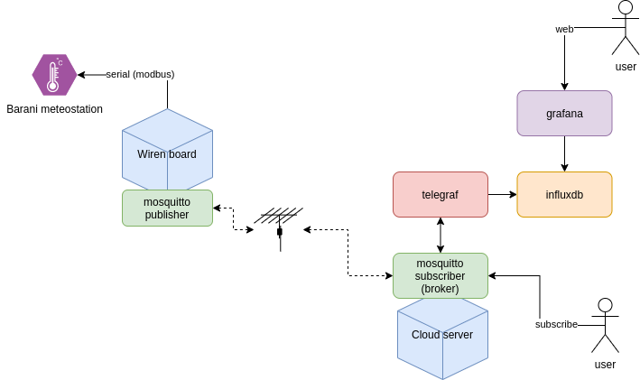

# "Чайка"

## Общая архитектура



Решение состоит из двух частей:

* серверная (cloud) часть: выступает внешним mqtt-брокером, накопителем данных и UI-сервером
* клиентская (target device) часть: выступает внутренним mqtt-брокером, получает непосредственные данные с датчиков метеостанции

### Сервер (Cloud)

Используется docker-compose для управления следующими сервисами:

* mosquitto: mqtt-брокер, который подписан на получение метрик от клиента
* telegraf: сборщик метрик, который собирает данные от mosquitto и записывает в db
* influxdb: db, предназначенная для хранения метрик
* grafana: web-UI, отображающий графики из метрик, хранящихся в db

#### mosquitto

Брокер подписывается на сборк данных от клиента (топики: `["/devices/barani/controls/#"]`). Используется конфигурационный файл mosqutto.conf и passwd.conf для ограничения доступа:
 * barani - креды для доступа к оригинальному брокеру
 * client - креды для доступа внешних клиентов к брокеру
 * telegraf - креды для доступа сервиса telegraf
 
 #### telegraf
 
 Агент сбора метрик из mosquitto и преобразования и записи в DB. Используется конфиг. файл telegraf.conf. Важные секции
 
 * конфигурация DB (адрес и креды для записи в DB):
 
 ```
 [[outputs.influxdb]]
  urls = ["http://influxdb:8086"]
  database = "sensors"
  skip_database_creation = true
  username = "telegraf"
  password = "telegraf"
```
* конфигурация подключения к mosquitto (адрес и креды для доступа)
```
[[inputs.mqtt_consumer]]
   servers = ["tcp://mosquitto:1883"]
   topics = ["/devices/barani/controls/#"]
   data_format = "value"
   data_type = "float"
   username = "telegraf"
   password = "telegraf"
   client_id = "telegraf"
   max_undelivered_messages = 1500
 ```
 
 #### influxdb (DB)

Долгосрочно хранит полученные метрики в базе. Испольуется persistent volume для хранения (перед первым стартом volume нужно создать)

#### grafana

Web-UI позволяет строить графики и дашборды с метриками. База метрик - DB (influx). Для установки плагинов используется файл plugins.conf.

### [Клиент](https://github.com/chayka-ws/chayka-wirenboard) (wirenboard)

Клиент / target platform / mqtt-publisher представляет собой WirenBoard с подключеннами к нему датчиками метеостанции (Barani). 
Для сбора метрик с датчиков используется штатные софтовые средства WirenBoard: wb-mqtt-serial, wb-homa-gpio. Для этого используются конфигурационные файлы:

#### etc/wb-mqtt-serial.conf

Конфигурация для подключения последовательного девайса с датчиками. Перезапуск сервиса после изменения конфига: `service wb-mqtt-serial restart`. 

#### /usr/share/wb-mqtt-serial/templates/config-barani.json

Конфигурация для сбора метрик с датчиков температуры/влажности/точки росы (modbus). Перезапуск сервиса после изменения конфига: `service wb-mqtt-serial restart`.

#### /etc/wb-rules/barani.js 

Правила для модификации собранных метрик в понятные и удобные значения (температура, влажность, направление ветра и проч). Данные значения экспортируются в mqtt, и именно их использует сервер для хранения:
* `barani/wind_direction/on` - направление ветра в град (0-360)
* `barani/temperature/on` - температура в град Цельсия
* `barani/humidity/on` - влажность в процентах (0-100)
* `barani/dew_point/on` - точка росы в град Цельсия
* `barani/wind_speed/on` - скорость ветра в м/с

__Ко всем данным mqtt-publisher добавляет `/on` (уот так уот)__

Перезапуск сервиса после изменения правил: `service wb-rules restart`.

# Переезд на новый сервер

* установить `ansible`, `ansible-galaxy`
* `ansible-galaxy install -r requirements.yml`
* поправить в файле `inventory` адрес хоста, юзернейм
* `ansible-playbook playbook.yml -i inventory`
* развернуть солюшн на сервере (не забыть про systemd)
